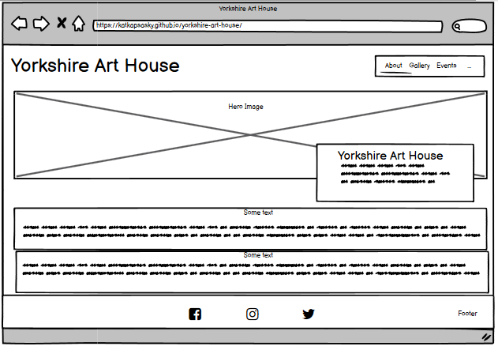
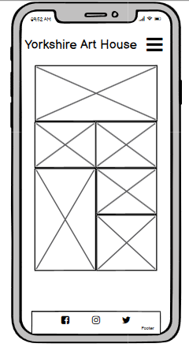
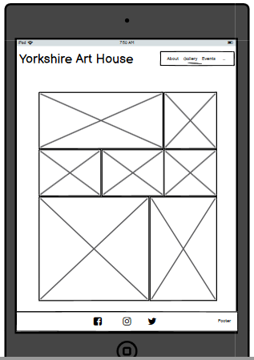
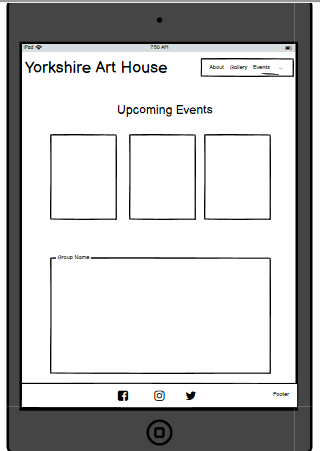
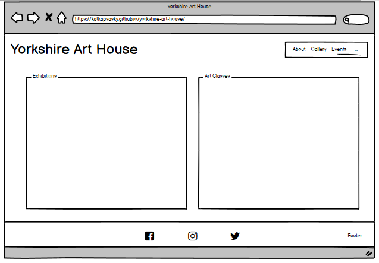

# Yorkshire Art House

The Yorkshire Art House is a landing page for art enthusiasts, collectors and students who are local to, or visiting, Yorkshire. The Yorkshire Art House provides information about the artist, showcases some of her work and offers upcoming dates for exhibitions and art classes.

Users of this website will be able to access information about the artist and contact details on the Homepage, images of the art work on the Gallery page, and dates of exhibitions and classes as well as a sign up form on the Events page, which are all accessible from the navigation bar in the header of all pages. The site is targeted at people of all ages with an interest in fine art, landscapes and the Yorkshire Dales.

Screenshot of webpage on common screen sizes using am I responsive.

---

## UX

The website is made up of three main pages. Each page has a consistent theme, using the same header and footer, fonts and colour scheme across each one.

The landing page is accessible via the logo and the Home link in the header which is fixed to the top of all pages. The Gallery and Events pages are also accessible via their respective links in the header on all pages

### User Stories

As a user, 
<ul>
<li>I would like to find information about the gallery including it's history, it's location, the type of artwork displayed and information about the artist. </li> 
<li>I would like to know the contact details for the gallery, including opening days and times, phone, email, address and social media links. </li>
</ul>

### Color Scheme

Explain colours, generate image palette using coolors.co

### Typography

Explain fonts and icon libraries used

### Wireframes

| Page | Responsiveness | Wireframe |
| --- | --- | --- |
| Home Page | [mobile](documentation/responsiveness/mobile-homepage.png) |  |
| Home Page | [tablet](documentation/responsiveness/tablet-homepage.png) |  |
| Home Page | [desktop](documentation/responsiveness/desktop-homepage.png) |  |
| Gallery Page | [mobile](documentation/responsiveness/mobile-gallery.png) |  |
| Gallery Page | [tablet](documentation/responsiveness/tablet-gallery.png) |  |
| Gallery Page | [desktop](documentation/responsiveness/desktop-gallery.png) |  |
| Events Page | [mobile](documentation/responsiveness/mobile-events.png) |  |
| Events Page | [tablet](documentation/responsiveness/tablet-events.png) |  |
| Events Page | [desktop](documentation/responsiveness/desktop-events.png) |  |

## Features

Briefly explain the project

### Existing Features

Screenshots of all main features and a few lines about what each feature does and how it benefits the user.

### Future Features 

Ideas of features to be added in the future.

---

## Technologies Used

HTML, CSS, Gitpod, GitHub, Git, Balsamiq etc. add links to each site if possible

---

## Testing

For all testing please refer to the [TESTING.md](testing/TESTING.md) file.

---

## Deployment

The site was deployed to GitHub pages. The steps to deploy are as follows: 
  - In the [GitHub repository](https://github.com/katkapsasky/yorkshire-art-house), navigate to the Settings tab 
  - From the source section drop-down menu, select the **Main** Branch, then click "Save".
  - The page will be automatically refreshed with a detailed ribbon display to indicate the successful deployment.

The live link can be found [here](https://katkapsasky.github.io/yorkshire-art-house/)

### Local Deployment

In order to make a local copy of this project, you can clone it. In your IDE Terminal, type the following command to clone my repository:

- `git clone https://github.com/katkapsasky/yorkshire-art-house.git`

Alternatively, if using Gitpod, you can click below to create your own workspace using this repository.

## Credits

Credit all code taken from other sources.

### Content

### Media

### Acknowledgements

---
