# Yorkshire Art House

The Yorkshire Art House is a landing page for art enthusiasts, collectors and students who are local to, or visiting, Yorkshire. The Yorkshire Art House provides information about the artist, showcases some of her work and offers upcoming dates for exhibitions and art classes.

Users of this website will be able to access information about the artist and contact details on the homepage, images of the art work on the gallery page, and dates of exhibitions and classes as well as a sign up form on the events page, which are all accessible from the navigation bar in the header of all pages. The site is targeted at people of all ages with an interest in fine art, landscapes and the Yorkshire Dales.

---

## UX

The website is made up of three main pages. Each page has a consistent theme, using the same header and footer, fonts and colour scheme across each one. 

### User Stories

As a user, 
<ul>
<li>I would like to find information about the gallery including it's history, it's location, the type of artwork displayed and information about the artist. </li> 
<li>I would like to know the contact details for the gallery, including opening days and times, phone, email, address and social media links. </li>
<li>I would like to view artwork by the artist</li>
<li>I would like to find information about services provided by the gallery, including arts classes and exhibitions.</li>
<li>I would like to sign up for further information and to get involved in activities such as art classes and exhibitions</li>
</ul>

### Color Scheme

The colors are inspired by the art work shown, specifically from the hero image on the homepage. The color scheme was generated using https://coolors.co

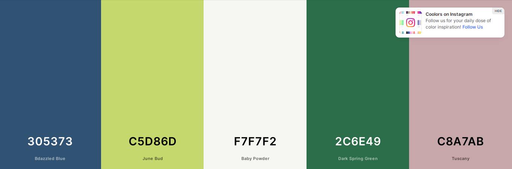

### Typography

The fonts were imported from [Google Fonts](https://fonts.google.com/). Montserrat (Light 300) is used for the logo and all headings, and Roboto (Light 300) is used for all other body elements.

The social media icons in the footer and the icons in the Contact Us section were taken from [Font Awesome.](https://fontawesome.com/icons)

### Wireframes

| Page | Responsiveness | Wireframe |
| --- | --- | --- |
| Home Page |  | 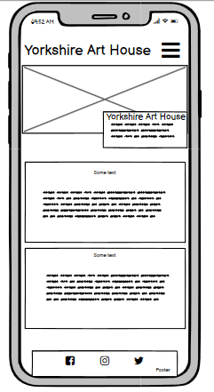 |
| Home Page |  | 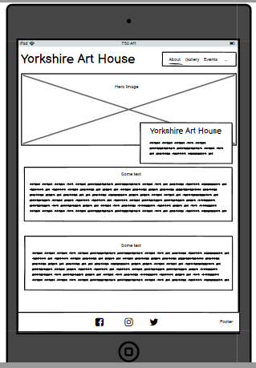 |
| Home Page |  |  |
| Gallery Page |  |  |
| Gallery Page |  |  |
| Gallery Page |  | 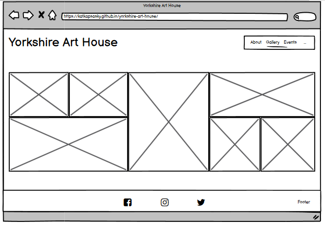 |
| Events Page | 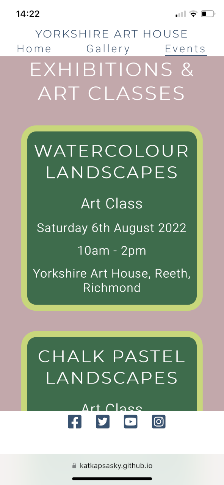 | 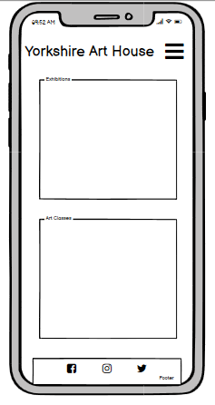 |
| Events Page |  |  |
| Events Page |  |  |

---

## Features

The Yorkshire Art House consists of three main pages: the homepage, gallery and events, and a confirmation page which users are taken to once they have signed up using the form. Each page has the same header, containing the navbar, and footer with social media links. 

### Existing Features

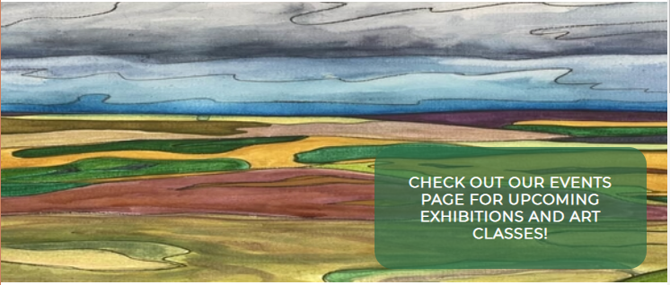
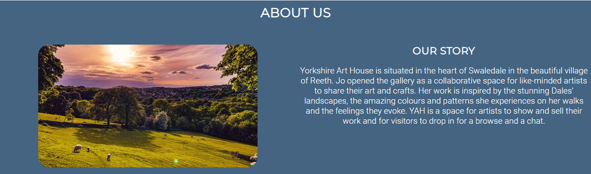
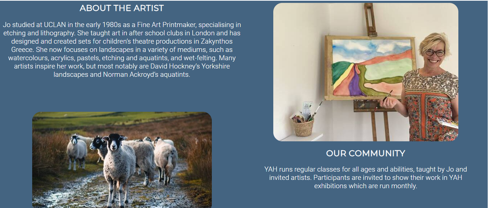
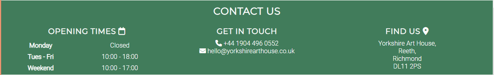
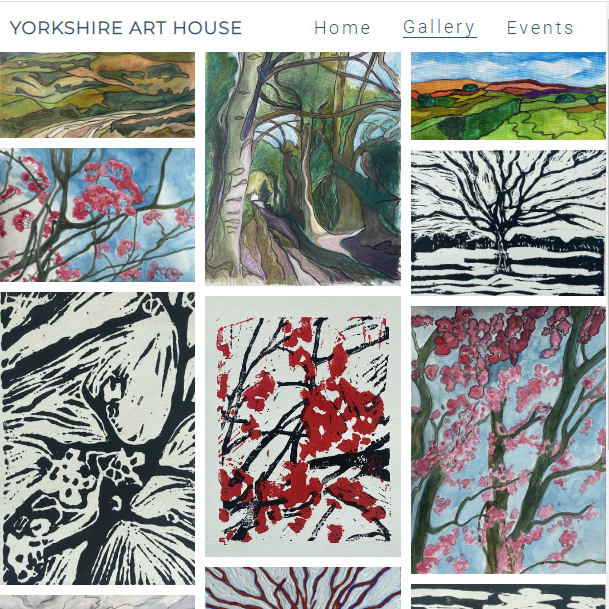
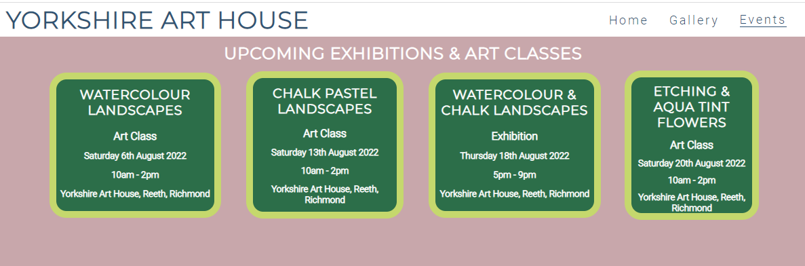
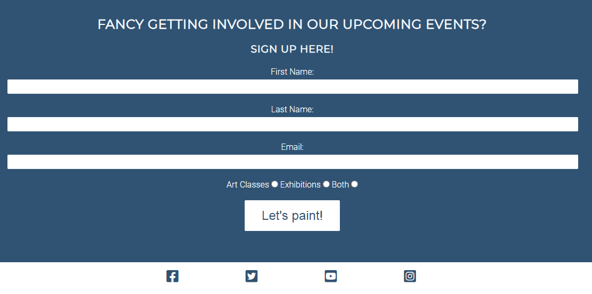
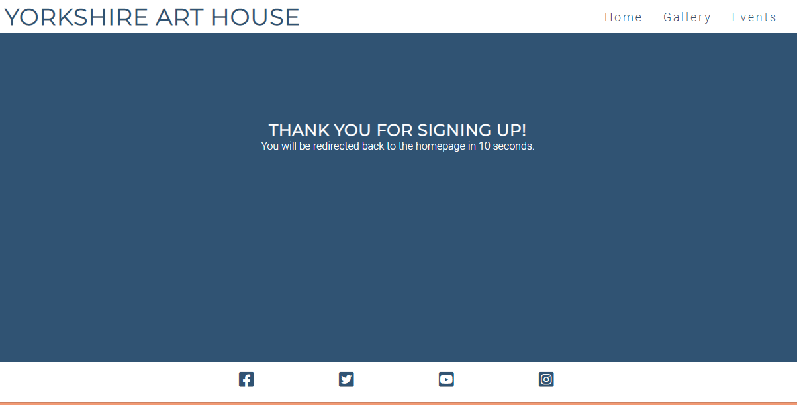

### Future Features 

Ideas of features to be added in the future.

---

## Technologies Used

<ul>
<li>HTML: Used for site layout and context</li>
<li>CSS: Used for site layout and aesthetics</li>
<li>[Gitpod:](https://gitpod.io) Used as a cloud-based development IDE</li>
<li>[Github:](https://github.com/) Used to securely store my code online</li>
<li>[Git:](https://git-scm.com/) Used for version control</li>
<li>[Balsamiq:](https://balsamiq.com/) Used for making wireframes</li>
<li>[TinyPng:](https://tinypng.com/) Used for compressing images</li>
<li>[Image Resizer:](https://imageresizer.com/) Used for resizing images</li>
</ul>

---

## Testing

For all testing please refer to the [TESTING.md](TESTING.md) file.

---

## Deployment

The site was deployed to GitHub pages. The steps to deploy are as follows: 
  - In the [GitHub repository](https://github.com/katkapsasky/yorkshire-art-house), navigate to the Settings tab 
  - From the source section drop-down menu, select the **Main** Branch, then click "Save".
  - The page will be automatically refreshed with a detailed ribbon display to indicate the successful deployment.

The live link can be found [here](https://katkapsasky.github.io/yorkshire-art-house/)

### Local Deployment

In order to make a local copy of this project, you can clone it. In your IDE Terminal, type the following command to clone my repository:

- `git clone https://github.com/katkapsasky/yorkshire-art-house.git`

Alternatively, if using Gitpod, you can click below to create your own workspace using this repository.

## Credits

### Code

### Content

### Media

### Acknowledgements

---
