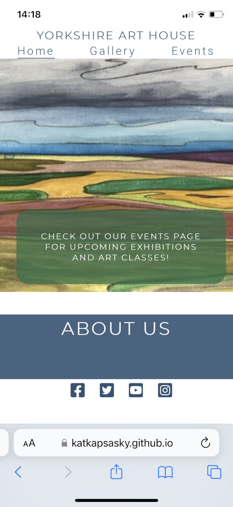
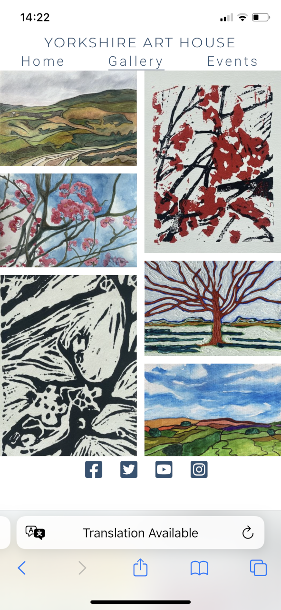

# Yorkshire Art House

The Yorkshire Art House is a landing page for art enthusiasts, collectors and students who are local to, or visiting, Yorkshire. The Yorkshire Art House provides information about the artist, showcases some of her work and offers upcoming dates for exhibitions and art classes.

Users of this website will be able to access information about the artist and contact details on the homepage, images of the art work on the gallery page, and dates of exhibitions and classes as well as a sign up form on the events page, which are all accessible from the navigation bar in the header of all pages. The site is targeted at people of all ages with an interest in fine art, landscapes and the Yorkshire Dales.

---

## UX

The website is made up of three main pages. Each page has a consistent theme, using the same header and footer, fonts and colour scheme across each one. 

### User Stories

As a user, 
- I would like to find information about the gallery including it's history, it's location, the type of artwork displayed and information about the artist.  
- I would like to know the contact details for the gallery, including opening days and times, phone, email, address and social media links. 
- I would like to view artwork by the artist
- I would like to find information about services provided by the gallery, including arts classes and exhibitions.
- I would like to sign up for further information and to get involved in activities such as art classes and exhibitions

### Color Scheme

The colors are inspired by the art work shown, specifically from the hero image on the homepage. The color scheme was generated using [Coolors](https://coolors.co).

### Typography

The fonts were imported from [Google Fonts](https://fonts.google.com/). Montserrat (Light 300) is used for the logo and all headings, and Roboto (Light 300) is used for all other body elements.

The social media icons in the footer and the icons in the Contact Us section were taken from [Font Awesome.](https://fontawesome.com/icons)

### Wireframes

| Page | Responsiveness | Wireframe |
| --- | --- | --- |
| Home Page |  |  |
| Home Page |  |  |
| Home Page |  |  |
| Gallery Page |  |  |
| Gallery Page |  |  |
| Gallery Page |  |  |
| Events Page |  |  |
| Events Page |  |  |
| Events Page |  |  |

---

## Features

The Yorkshire Art House consists of three main pages: the homepage, gallery and events, and a confirmation page which users are taken to once they have signed up using the form. Each page has the same header, containing the navbar, and footer with social media links. 

### Existing Features

#### Header
The header contains the navbar which is made up of the Yorkshire Art House logo on the left, and the Home, Gallery and Events clickable links on the right which allow the user to easily navigate between the three site pages. The logo is also a clickable link for the homepage. The header is consistent across all pages of the site.

#### Footer
The footer is fixed to the bottom of each page and is consistent across the site. It contains social media links to Facebook, Twitter, Youtube and Instagram, which open in a new tab when clicked. 

#### Home: Hero Image and Call to Action
The hero image sits at the top of the homepage and is a piece of art created by the artist, Jo Thomas, whose work is on display throughout the Yorkshire Art House website. This gives users a chance to see the artwork as soon as they land on the homepage. The colours of the site are inspired by this image to keep a consistent theme throughout.
The call to action overlays the hero image and contains a clickable link to the events page so that users can quickly and easily access the services the gallery offers and more information about getting involved. 

#### Home: About Us
The about us section is split into three parts, each with a heading, paragraph of text and an image. 
The first section, Our Story, provides background information about the gallery and inspiration behind the artwork displayed. The image is of a field in Reeth, where the gallery is set.
The middle section, About the Artist, provides a brief history of the artist's education and working artistic background. The image shows the artist painting a colourful landscape on an easel. 
The final section, Our Community, details information about the services offered by the Yorkshire Art House, including art classes and exhibitions. The photo is of a flock of sheep in Reeth.

#### Home: Contact Us
The contact information can be found under the about us section and is split into three parts. 
The opening times show the days and times the gallery is open for visitors, the get in touch section provides a phone number and email address, and the find us section shows the gallery address.  

#### Gallery
The gallery page is the second website page, accessible via the navbar. It features a masonry design which showcases some of the artists artwork for users to view. 

#### Events: Information
The top section of the events page offers information on upcoming art classes and exhibitions. There are four upcoming events, each detailing what type of event, more specific information about the art involved as well as the date time and location of each.

#### Events: Form
The bottom section of the events page consists of a form which allows users to sign up for upcoming events by submitting their first and last names, email address, and selecting if they are interested in art classes, exhibitions or both using the radio buttons provided. Once all the information is filled in, clicking on the "Let's Paint!" submit button, the user will be redirected to the confirmation page.

#### Confirmation Page
The confirmation page is only accessible once a form has been submitted. It contains a message giving the user confirmation that they have signed up successfully and advises they will be redirected to the homepage in 10 seconds. The page features the same header and footer as all other pages for consistency, and so the navbar is available should the user not be redirected automatically.

### Future Features 

- A map to be included in the Contact Us section to allow users to access location information more quickly and easily
- A hamburger menu on tablet and mobile screen devices to provide a more intuitive user experience
- Enable form submissions to be sent directly to the artist's email address so she can manage and respond to users wanting to get involved
- A video tutorial section with embedded videos, allowing users to learn to paint from home

---

## Technologies Used

- HTML: Used for site layout and context
- CSS: Used for site layout and aesthetics
- CSS Grid: Used for site layout, aesthetics and responsiveness
- CSS Flexbox: Used for site layout, aesthetics and responsiveness
- [Gitpod](https://gitpod.io): Used as a cloud-based development IDE
- [Github](https://github.com/): Used to securely store my code online
- [Git](https://git-scm.com/): Used for version control
- [Balsamiq](https://balsamiq.com/): Used for making wireframes
- [TinyPng](https://tinypng.com/): Used for compressing images
- [Image Resizer](https://imageresizer.com/): Used for resizing images
- [Eyedropper](https://eyedropper.org/installed): Used for selecting colors from the hero image
- [Coolors](https://coolors.co/305373-c5d86d-f7f7f2-2c6e49-c8a7ab): Used for creating the website color palette

---

## Testing

For all testing please refer to the [TESTING.md](TESTING.md) file.

---

## Deployment

The site was deployed to GitHub pages. The steps to deploy are as follows: 
  - In the [GitHub repository](https://github.com/katkapsasky/yorkshire-art-house), navigate to the Settings tab 
  - From the source section drop-down menu, select the **Main** Branch, then click "Save".
  - The page will be automatically refreshed with a detailed ribbon display to indicate the successful deployment.

The live link can be found [here](https://katkapsasky.github.io/yorkshire-art-house/)

### Local Deployment

In order to make a local copy of this project, you can clone it. In your IDE Terminal, type the following command to clone my repository:

- `git clone https://github.com/katkapsasky/yorkshire-art-house.git`

Alternatively, if using Gitpod, you can click below to create your own workspace using this repository.

## Credits

### Code
- [Code Institute: Coders Coffeehouse](https://codeinstitute.net/) for:
 - Table structure for opening times in contact us section

- [Code Institute: Love Running Project](https://codeinstitute.net/) for:
 - General body CSS style rules
 - Logo and navbar styling
 - Hero image and cover text initial styling
 - Hero image zoom effect 
 - Gallery page, image masonry styling
 - Events info initial styling
 - HTML and CSS for form structure and styling
 - CSS media queries

- [W3 Schools: Learn CSS Grid](https://www.w3schools.com/css/css_grid.asp), [FreeCodeCamp: CSS Grid](https://www.freecodecamp.org/learn/responsive-web-design/css-grid/create-your-first-css-grid), [CSS Grid Garden](https://cssgridgarden.com/), [Mozilla Developer](https://developer.mozilla.org/en-US/docs/Web/CSS/CSS_Grid_Layout/Realizing_common_layouts_using_CSS_Grid_Layout) and [Learn CSS Grid](https://learncssgrid.com/#spanning-items) for:
 - Navbar styling for desktop, tablet and mobile
 - About Us section styling for desktop, tablet and mobile
 - Contact Us section styling for desktop, tablet and mobile
 - Footer styling for desktop
 - Events information section styling for desktop

- [W3 Schools How to - Fixed Menu](https://www.w3schools.com/howto/howto_css_fixed_menu.asp) for creating a fixed navbar.

- [W3 Schools - Flexbox](https://www.w3schools.com/css/css3_flexbox.asp) for events information styling for tablet and mobile.

- [W3 Schools - Styling images](https://www.w3schools.com/css/css3_images.asp) for editing border radius on images in about us section.

- [Coder Coder!](https://coder-coder.com/responsive-navigation-bar-flexbox-vs-css-grid/) for navbar styling for desktop.

- [Fake Number](https://fakenumber.org/uk/york) for generating a realistic, fake phone number for the contact us, get in touch section. 

- My mentor, Tim Nelson for:
 - How to align the call to action across desktop, tablet and mobile
 - How to center images within a div for the about us section
 - How to create a page which redirects after a set amount of time
 - How to create a sticky footer 

### Content
- My mum, Jo Thomas for providing the wording for the about us sections, and the themes for the upcoming art classes and exhibitions.

### Media
- My mum, Jo Thomas who created the artwork in the hero image and the gallery page. 
- [Shane Rounce, Unsplash](https://unsplash.com/photos/ad1bmH7-fJU) for the first image in the about us section.
- Middle image taken by myself.
- [Illiya Vjestica, Unsplash](https://unsplash.com/photos/pP4eKGzZWdI) for the bottom image in the about us section. 

### Acknowledgements
- My mum, Jo Thomas, without whom the artwork and the idea for the Yorkshire Art House website would not exist. 
- My mentor, Tim Nelson, for his invaluable feedback, insight and support in fixing many bugs alongs the way.
- The Code Institute Slack community for providing countless helpful tips and tricks. 
---
