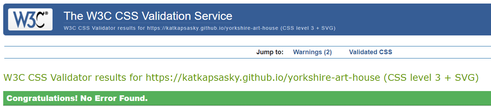
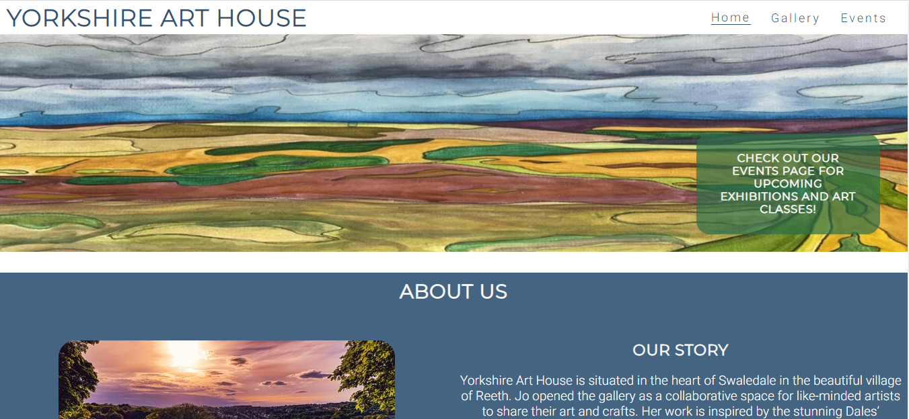
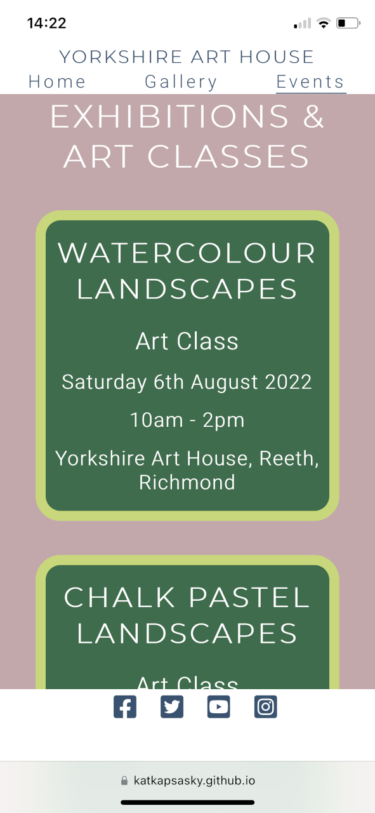

# Testing

Click to return back to the [README.md](README.md) file. 

Manual testing has been carried out which includes:
- Testing form validates input and redirects to confirmation page
- Navbar links work correctly
- Call to action link is correctly redirecting to events page
- All internal links open in the same page
- All external links open in a new tab
- Images are showing correctly and alt attributes have been added
- Text and images are visible on desktop, tablet and mobile screens

## Browser Compatibility 

The website has been tested on Google Chrome, Safari and Edge. The screenshots below show sections of the site on each browser.

## Code Validation

HTML Validation:

https://validator.w3.org/nu/?doc=https://katkapsasky.github.io/yorkshire-art-house/index.html

https://validator.w3.org/nu/?doc=https://katkapsasky.github.io/yorkshire-art-house/gallery.html

https://validator.w3.org/nu/?doc=https://katkapsasky.github.io/yorkshire-art-house/events.html

https://validator.w3.org/nu/?doc=https://katkapsasky.github.io/yorkshire-art-house/confirmation.html

CSS Validation:

https://jigsaw.w3.org/css-validator/validator?uri=https%3A%2F%2Fkatkapsasky.github.io%2Fyorkshire-art-house

## Responsiveness

| Page | Screensize | Responsiveness |
| --- | --- | --- |
| Home Page | Mobile |  |
| Home Page | Tablet |  |
| Home Page | Desktop |  |
| Gallery Page | Mobile |  |
| Gallery Page | Tablet |  |
| Gallery Page | Desktop |  |
| Events Page | Mobile |  |
| Events Page | Tablet |  |
| Events Page | Desktop |  |

## Accessibility

## Bugs

### Fixed Bugs

The form was initially set up to send submitted data to the Code Institute Formdump and so was set up with a method of Post. When creating the confirmation page for users who have submitted information via the form I received an error 501.

By removing the method and it's value of post from the form I fixed the bug and users who submit the form are now correctly redirected to the confirmation page.

### Unfixed Bugs

There are no remaining bugs that I am aware of.